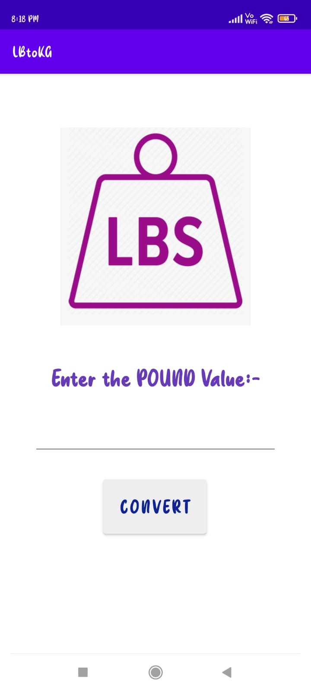
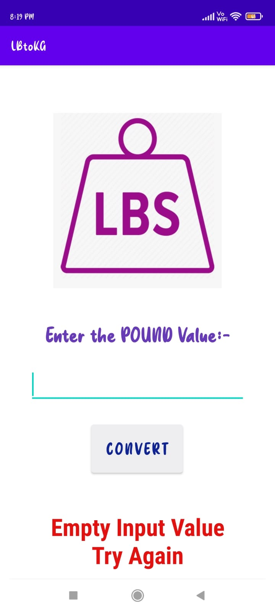
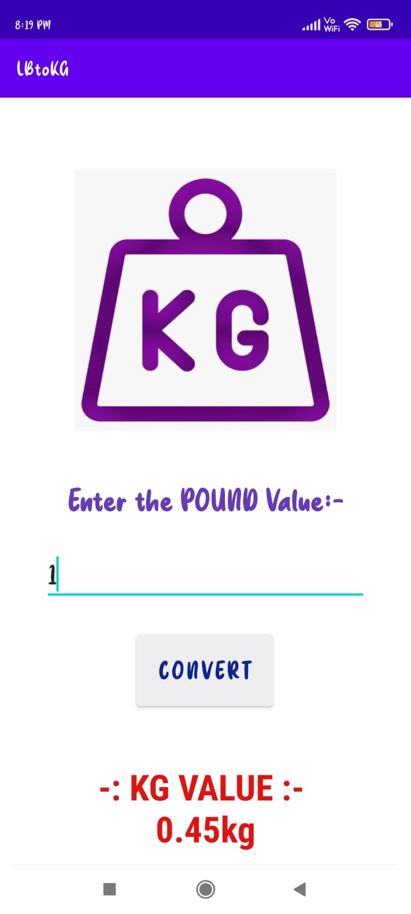

# LBtoKG

***This 'Number Checking System' using Java is created by Ankita Sikder, student of BTECH, in University of Engineering and Management, Kolkata.***

**Email Id: ankita.sikder14@gmail.com.** 

<p align="left">
<a href="https://facebook.com/ankita.sikder.104" target="blank"></a>
<a href="https://instagram.com/ankita.sikder14" target="blank"></a>
<a href="https://github.com/ankitasikder" target="blank"></a>
</p>

[](https://shields.io/) 

## About :point_down: 

<div align="justified">
  

  
</div>
 
## Folder Structure :point_down:

```bash
NCS-JAVA
 └── Src
      ├── Main.java
      ├── COMPONENTS
      |    ├── DEFINITIONS.java


```                                  

## Screenshots of NCS :point_down: 

<div align="center">
 
<a href="pics/lb1.jpeg"></a> <a href="pics/lb2.jpeg"></a> <a href="pics/lb3.jpeg"></a>


</div>


